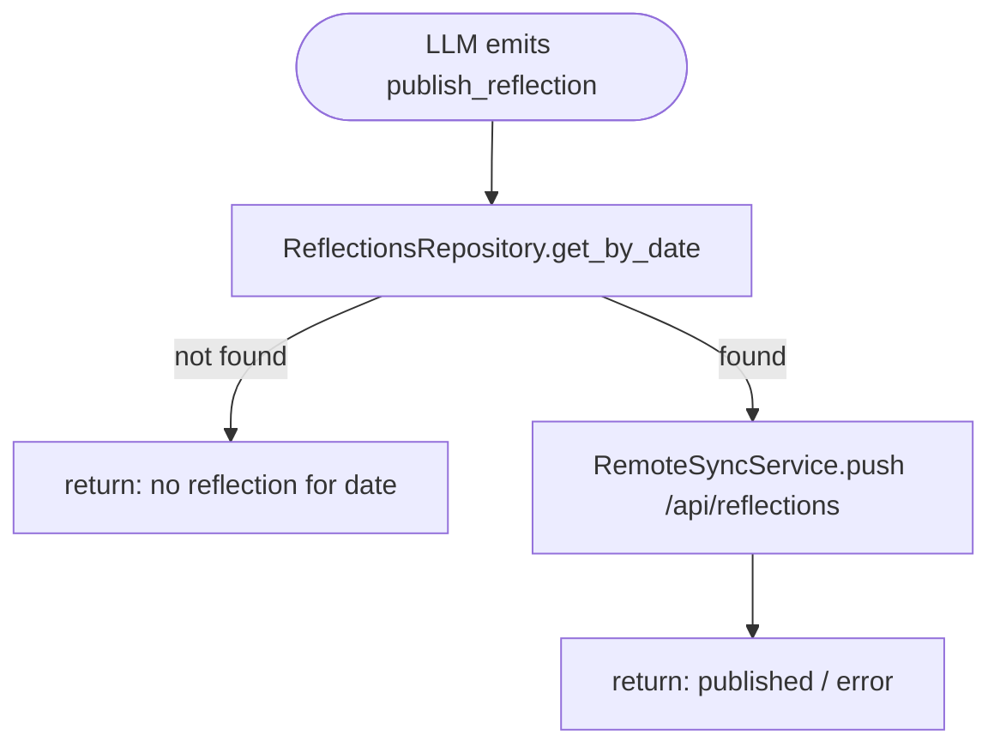
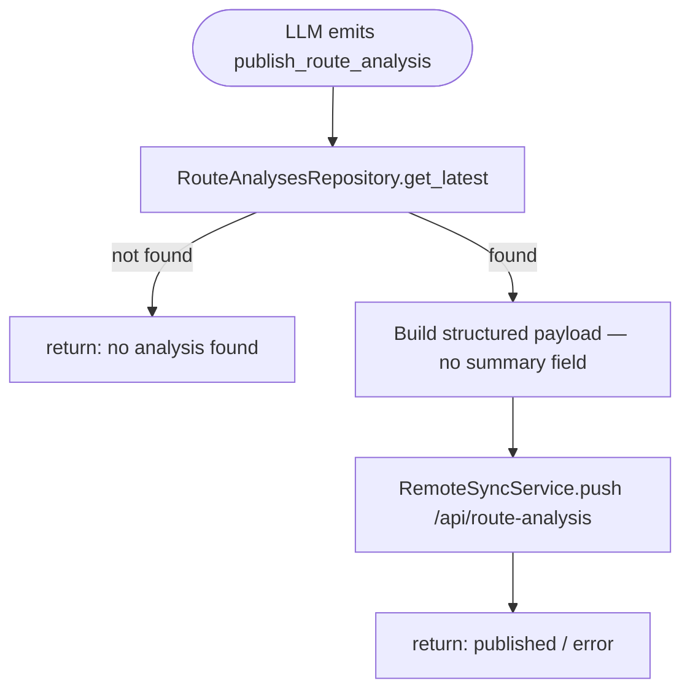
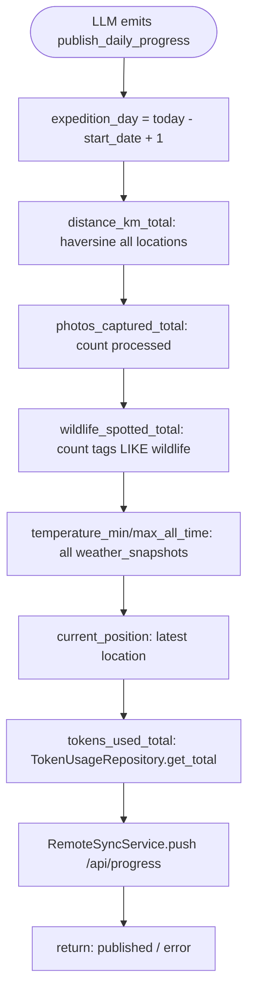

# Antarctic Expedition Agent — Phase 2

## Phase 1 Summary (c1–c27.5)

Phase 1 built the full local agent stack: core runtime with recursive tool chaining, SQLite DB, CLI with status bar and spinner, HTTP server for iPhone GPS ingestion, photo pipeline (scan → preprocess → vision → scoring → move), weather fetching, embedding-based knowledge base, activity logging, distance calculation, token usage tracking, route analysis (bearing/speed/wind/nearest sites), daily reflection, and the terminal scroll/semaphore model. All LLM calls are local via Ollama.

---

## Overview

Phase 2 completes the **outbound publishing layer** (agent → Railway server). Photos gain GPS coordinates at processing time and tags for wildlife classification. Four publish actions are properly implemented. Token usage is reported in the progress payload.

---

## Commit History

| #    | Description                                                                                        | Status              |
|------|----------------------------------------------------------------------------------------------------|---------------------|
| 1    | Project setup, core models, config loader                                                          | ✅ Done             |
| 2    | StateStore, OutputHandler, ActionParser, PromptBuilder                                             | ✅ Done             |
| 3    | Runtime orchestrator                                                                               | ✅ Done             |
| 4    | CLI interface                                                                                      | ✅ Done             |
| 5    | OllamaClient + system prompt engineering                                                           | ✅ Done             |
| 6    | FileStateStore + enhanced CLI (status bar, spinner, terminal layout)                               | ✅ Done             |
| 7    | DB layer: aiosqlite + 6 repos (locations, photos, weather, tasks, messages, sessions)              | ✅ Done             |
| 8    | Models: LocationRecord, TaskRecord, PhotoRecord                                                     | ✅ Done             |
| 9    | expedition_config.json                                                                             | ✅ Done             |
| 10   | HTTP server: POST /locations → process_location task                                               | ✅ Done             |
| 11   | ExecutionSemaphore + Scheduler (60s tick, weather schedule)                                        | ✅ Done             |
| 12   | Semaphore redesign + FIFO tasks + CLI async input + recursive runtime chaining                     | ✅ Done             |
| 13   | TaskRunner: dispatches all task types + CLI task progress output                                   | ✅ Done             |
| 14   | OllamaClient + .env + DB wiring + scheduler/HTTP/semaphore in \_\_main\_\_                        | ✅ Done             |
| 15   | WeatherService: Open-Meteo ECMWF + DB persistence + `get_weather`                                 | ✅ Done             |
| 16   | CLI status bar: location + weather + precipitation + 5min auto-refresh                             | ✅ Done             |
| 17   | ImagePreprocessingService (Pillow EXIF + resize) + OllamaVisionClient (qwen2.5vl:7b)              | ✅ Done             |
| 18   | PhotoService: scan inbox → preprocess → vision → scoring → move                                   | ✅ Done             |
| 19   | Knowledge pipeline: ChromaDB + nomic-embed-text + `search_knowledge` / `index_knowledge`          | ✅ Done             |
| 20   | Activity log: auto-logging all tool calls + `get_logs` action                                     | ✅ Done             |
| 21   | Distance service: Haversine + `get_distance` action + status bar `↗ km today`                    | ✅ Done             |
| 21.5 | Token usage: all LLM calls logged to DB + global counter + status bar + `get_token_usage`        | ✅ Done             |
| 21.6 | Scroll region fix: `_scroll_row` tracking + `_readline_active` split                              | ⏳ Pending commit   |
| 22   | Soul prompt: agent identity injected in every LLM call                                            | ⏸️ Postponed        |
| 23   | `add_location`: manual GPS insertion (fallback when iPhone fails)                                  | ⏳ Pending commit   |
| 24   | Daily reflection: `create_reflection` action + scheduled once-a-day task                           | ⏳ Pending commit   |
| 25   | Twitter/X: `post_tweet` + `tweet_image` actions                                                   | ⏸️ Postponed        |
| 26   | Photo appreciation: emotional/scientific appraisal added to vision                                | ⏸️ Postponed        |
| 27   | Route analysis: `analyze_route` + `get_route_analysis` + scheduled every 12h                      | ⏳ Pending commit   |
| 27.5 | Semaphore fix: remove `_poll_typing` + task spinner during background tasks                       | ⏳ Pending commit   |
| 28   | Photo model: latitude + longitude at process time + `tags` column + `get_wildlife_count`          | 🔜 Next             |
| 29   | RemoteSyncService + config (`start_date`, `base_url_env`) + DB helpers                            | 📋 Planned          |
| 30   | `publish_reflection` + `publish_route_analysis` actions                                           | 📋 Planned          |
| 31   | `publish_daily_progress`: expedition_day, all-time stats, wildlife, `tokens_used_total`           | 📋 Planned          |
| 32   | `upload_image` real implementation: multipart POST + tags + GPS in metadata                       | 📋 Planned          |
| 33   | `agent_quote` auto-generation at scoring time                                                     | 📋 Planned          |
| 34   | Twitter/X integration                                                                              | 📋 Planned          |

---

## Actions (Phase 2 additions)

### `publish_reflection`

Reads today's (or specified date's) reflection from DB and POSTs to `/api/reflections`.



Parameters: `payload.date` — optional YYYY-MM-DD, defaults to today.

---

### `publish_route_analysis`

Reads latest (or date-specific) route analysis from DB and POSTs to `/api/route-analysis`.



Parameters: `payload.date` — optional YYYY-MM-DD.

---

### `publish_daily_progress` (reimplemented)

Aggregates all-expedition running totals and POSTs to `/api/progress`.



---

## Commit 28 — Photo model: GPS at process time + tags

### Design

Photos are geo-tagged at **processing time** (when vision + scoring runs), not at upload. This captures where the ship was when the photo was discovered — more semantically meaningful than the upload moment (which can happen hours or days later).

Tags are stored as a JSON array in a `tags TEXT` column (e.g. `["wildlife","penguin"]`). Agent sets tags explicitly at `upload_image` time. No auto-tagging in this commit.

### Changed files

#### `src/agent/db/database.py`

Add migrations for three new photo columns (after existing `agent_quote` migration):
```python
for col in ("latitude REAL", "longitude REAL", "tags TEXT"):
    try:
        await self._conn.execute(f"ALTER TABLE photos ADD COLUMN {col}")
    except Exception:
        pass
```

#### `src/agent/db/photos_repo.py`

Add `get_wildlife_count()`:
```python
async def get_wildlife_count(self) -> int:
    """Count photos tagged with 'wildlife'."""
    async with self._db.conn.execute(
        "SELECT COUNT(*) FROM photos WHERE tags LIKE '%wildlife%'"
    ) as cur:
        row = await cur.fetchone()
    return row[0] if row else 0
```

#### `src/agent/services/photo_service.py`

At the end of `process_photo()`, before the final `repo.update()` call, fetch the latest GPS and include in the update:
```python
from agent.db.locations_repo import LocationsRepository
latest_locs = await LocationsRepository(self._db).get_latest(limit=1)
lat = latest_locs[0]["latitude"] if latest_locs else None
lon = latest_locs[0]["longitude"] if latest_locs else None

await photos_repo.update(
    photo_id,
    vision_status="done",
    vision_description=vision_result.description,
    vision_model=self._config.agent.vision_model,
    significance_score=score,
    is_remote_candidate=1 if is_candidate else 0,
    processed=1,
    processed_at=datetime.now(timezone.utc).isoformat(),
    moved_to_path=str(moved_path),
    latitude=lat,
    longitude=lon,
)
```

### Test

```bash
# Drop photo in inbox, wait for process_photo task
sqlite3 data/expedition.db "SELECT id, file_name, latitude, longitude FROM photos ORDER BY id DESC LIMIT 3;"
# Expect: lat/lon populated matching latest location at processing time
```

---

## Commit 29 — RemoteSyncService + config

### Design

A thin stateless HTTP client handles all outbound pushes. No retry logic, no caching — if the server is down the agent gets an error and can retry manually. Credentials loaded from env at instantiation time.

### New file: `src/agent/services/remote_sync_service.py`

```python
import json
import os

import httpx

from agent.config.loader import Config


class RemoteSyncService:
    def __init__(self, config: Config) -> None:
        self._base_url = os.environ.get(config.remote_sync.base_url_env, "").rstrip("/")
        self._api_key  = os.environ.get(config.remote_sync.api_key_env, "")

    def _headers(self) -> dict:
        return {"Authorization": f"Bearer {self._api_key}"}

    async def push(self, path: str, payload: dict) -> dict:
        """POST JSON payload. Returns {"ok": True} or {"ok": False, "error": str}."""
        headers = {**self._headers(), "Content-Type": "application/json"}
        try:
            async with httpx.AsyncClient(timeout=30) as client:
                r = await client.post(f"{self._base_url}{path}", json=payload, headers=headers)
                r.raise_for_status()
            return {"ok": True}
        except Exception as exc:
            return {"ok": False, "error": str(exc)}

    async def push_photo(self, file_path: str, file_name: str, metadata: dict) -> dict:
        """Multipart POST for /api/photos."""
        try:
            with open(file_path, "rb") as f:
                file_bytes = f.read()
            files = {"file": (file_name, file_bytes, "image/jpeg")}
            data  = {"metadata": json.dumps(metadata)}
            async with httpx.AsyncClient(timeout=60) as client:
                r = await client.post(
                    f"{self._base_url}/api/photos",
                    headers=self._headers(),
                    files=files,
                    data=data,
                )
                r.raise_for_status()
            return {"ok": True}
        except Exception as exc:
            return {"ok": False, "error": str(exc)}
```

### Changed files

#### `src/agent/config/loader.py`

Add `start_date: str` to `AgentConfig`:
```python
start_date: str = "2026-03-17"
```

Add `base_url_env: str` to `RemoteSyncConfig`:
```python
base_url_env: str = "REMOTE_SYNC_BASE_URL"
```

#### `configs/expedition_config.json`

```json
"agent": {
  "start_date": "2026-03-17",
  ...
},
"remote_sync": {
  "base_url_env": "REMOTE_SYNC_BASE_URL",
  "api_key_env": "REMOTE_SYNC_API_KEY",
  "max_images_per_batch": 3,
  "max_images_per_day": 10
}
```

#### `src/agent/db/weather_repo.py`

Add `get_all_time_temps()`:
```python
async def get_all_time_temps(self) -> dict:
    async with self._db.conn.execute(
        "SELECT MIN(temperature), MAX(temperature) FROM weather_snapshots"
    ) as cur:
        row = await cur.fetchone()
    return {"min": row[0], "max": row[1]}
```

### Test

```bash
# Set env vars in .env
REMOTE_SYNC_BASE_URL=https://your-server.railway.app
REMOTE_SYNC_API_KEY=your_key

# Quick smoke test (from python REPL with .env loaded):
# RemoteSyncService should instantiate cleanly and push() should return {"ok": True}
# or a clear error dict if the server is unreachable.
```

---

## Commit 30 — `publish_reflection` + `publish_route_analysis`

### Design

Two simple publish actions: each reads one DB record and POSTs it. Both default to the most recent record if no date is specified. No `summary` field in route-analysis payload (redundant — frontend renders its own).

### Changed files

#### `src/agent/models/actions.py`

```python
class PublishReflectionAction(ToolAction):
    type: Literal["publish_reflection"] = "publish_reflection"
    payload: dict = {}   # optional: {"date": "YYYY-MM-DD"}

class PublishRouteAnalysisAction(ToolAction):
    type: Literal["publish_route_analysis"] = "publish_route_analysis"
    payload: dict = {}   # optional: {"date": "YYYY-MM-DD"}
```

#### `src/agent/runtime/parser.py`

Register:
```python
"publish_reflection": PublishReflectionAction,
"publish_route_analysis": PublishRouteAnalysisAction,
```

#### `src/agent/runtime/runtime.py`

```python
async def _tool_publish_reflection(self, payload: dict) -> str:
    date = payload.get("date") or _local_today(self._config.agent.timezone)
    db = self._require_db()
    reflection = await ReflectionsRepository(db).get_by_date(date)
    if not reflection:
        return f"no reflection for {date}"
    result = await RemoteSyncService(self._config).push("/api/reflections", {
        "date": reflection["date"],
        "content": reflection["content"],
        "created_at": reflection["created_at"],
    })
    return f"reflection published for {date}" if result["ok"] else f"error: {result['error']}"

async def _tool_publish_route_analysis(self, payload: dict) -> str:
    date = payload.get("date")
    db = self._require_db()
    repo = RouteAnalysesRepository(db)
    a = await repo.get_by_date(date) if date else await repo.get_latest()
    if not a:
        return "no route analysis found"
    nearest = json.loads(a.get("nearest_sites_json") or "[]")
    result = await RemoteSyncService(self._config).push("/api/route-analysis", {
        "analyzed_at": a["analyzed_at"],
        "date": a["date"],
        "window_hours": a["window_hours"],
        "position": {"latitude": a["latitude"], "longitude": a["longitude"]},
        "bearing_deg": a["bearing_deg"],
        "bearing_compass": a["bearing_compass"],
        "speed_kmh": a["speed_kmh"],
        "avg_speed_kmh": a["avg_speed_kmh"],
        "distance_km": a["distance_km"],
        "stopped": bool(a["stopped"]),
        "wind": {
            "speed_kmh": a["wind_speed_kmh"],
            "direction_deg": a["wind_direction_deg"],
            "angle_label": a["wind_angle_label"],
        },
        "nearest_sites": nearest,
    })
    return f"route analysis published for {a['date']}" if result["ok"] else f"error: {result['error']}"
```

#### `src/agent/db/tasks_repo.py`

Add to `VALID_TASK_TYPES`:
```python
"publish_reflection",
"publish_route_analysis",
```

#### `src/agent/runtime/task_runner.py`

```python
case "publish_reflection":
    await self._runtime._tool_publish_reflection(payload)
case "publish_route_analysis":
    await self._runtime._tool_publish_route_analysis(payload)
```

#### `configs/expedition_config.json`

Add action entries and update system prompt listing.

### Test

```bash
# Via agent: "publish today's reflection"
# Expect: POST to /api/reflections with date + content, 200 response

# Via agent: "publish the route analysis"
# Expect: POST to /api/route-analysis with structured fields, no summary key
curl -s -X GET https://your-server.railway.app/api/route-analysis | jq 'keys'
# Should NOT contain "summary"
```

---

## Commit 31 — `publish_daily_progress`: full aggregation

### Design

Aggregates all-expedition running totals from multiple DB tables. `expedition_day` computed from `start_date` config. All-time distance sums haversine across every recorded location. Token usage from `token_usage` table. The server **overwrites** the previous snapshot — always sends full state.

### Changed files

#### `src/agent/runtime/runtime.py`

Replace stubbed `_tool_publish_daily_progress` with:

```python
async def _tool_publish_daily_progress(self, payload: dict) -> str:
    from datetime import date as date_type
    db = self._require_db()
    today_str = _local_today(self._config.agent.timezone)

    # expedition_day
    start = date_type.fromisoformat(self._config.agent.start_date)
    expedition_day = (date_type.fromisoformat(today_str) - start).days + 1

    # all-time distance (reuse haversine from route_analysis_service)
    from agent.services.route_analysis_service import _haversine
    all_locs = await LocationsRepository(db).get_all()
    total_km = 0.0
    for i in range(1, len(all_locs)):
        total_km += _haversine(
            all_locs[i-1]["latitude"], all_locs[i-1]["longitude"],
            all_locs[i]["latitude"],   all_locs[i]["longitude"],
        )

    photos_total   = len(await PhotosRepository(db).get_all(vision_status="done"))
    wildlife_total = await PhotosRepository(db).get_wildlife_count()
    temps          = await WeatherRepository(db).get_all_time_temps()
    latest         = await LocationsRepository(db).get_latest(limit=1)
    position       = {"latitude": latest[0]["latitude"], "longitude": latest[0]["longitude"]} if latest else None
    tokens         = await TokenUsageRepository(db).get_total()

    result = await RemoteSyncService(self._config).push("/api/progress", {
        "expedition_day":          expedition_day,
        "distance_km_total":       round(total_km, 2),
        "photos_captured_total":   photos_total,
        "wildlife_spotted_total":  wildlife_total,
        "temperature_min_all_time": temps["min"],
        "temperature_max_all_time": temps["max"],
        "current_position":        position,
        "tokens_used_total":       tokens["total"],
        "published_at":            datetime.now(timezone.utc).isoformat(),
    })
    return "daily progress published" if result["ok"] else f"error: {result['error']}"
```

Note: `_haversine` is a module-level function in `route_analysis_service.py` — import directly rather than duplicating.

### Test

```bash
# Via agent: "publish daily progress"
# Check server received correct payload:
curl -s https://your-server.railway.app/api/progress | jq '{expedition_day, distance_km_total, tokens_used_total, wildlife_spotted_total}'

# Verify token count matches DB:
sqlite3 data/expedition.db "SELECT SUM(prompt_tokens+completion_tokens) FROM token_usage;"
```

---

## Commit 32 — `upload_image`: real multipart POST

### Design

Completes the `upload_image` stub. Reads the processed photo file, builds multipart metadata (GPS from photo record, agent_quote if set, tags), POSTs to `/api/photos`, and marks `remote_uploaded=1`. Agent can optionally pass `tags` list at upload time.

### Changed files

#### `src/agent/runtime/runtime.py`

Replace stubbed `_tool_upload_image` with:

```python
async def _tool_upload_image(self, payload: dict) -> str:
    import json as _json
    db = self._require_db()
    photo_id    = int(payload["photo_id"])
    agent_quote = payload.get("agent_quote")
    tags        = payload.get("tags")  # list[str] or None

    repo  = PhotosRepository(db)
    photo = await repo.get_by_id(photo_id)
    if not photo:
        return f"photo {photo_id} not found"
    if not photo.get("is_remote_candidate"):
        return f"photo {photo_id} is not a remote candidate"

    # persist agent_quote and tags
    update_fields: dict = {}
    if agent_quote is not None:
        update_fields["agent_quote"] = agent_quote
    if tags is not None:
        update_fields["tags"] = _json.dumps(tags)
    if update_fields:
        await repo.update(photo_id, **update_fields)

    # resolve file path (preview for upload)
    file_path = photo.get("vision_preview_path") or photo.get("moved_to_path")
    if not file_path or not Path(file_path).exists():
        return f"photo file not found: {file_path}"

    metadata = {
        "file_name":          photo["file_name"],
        "recorded_at":        photo.get("processed_at") or photo["discovered_at"],
        "latitude":           photo.get("latitude"),
        "longitude":          photo.get("longitude"),
        "significance_score": photo.get("significance_score"),
        "vision_description": photo.get("vision_description"),
        "vision_summary":     None,
        "agent_quote":        agent_quote,
        "width":              photo.get("vision_input_width"),
        "height":             photo.get("vision_input_height"),
    }

    result = await RemoteSyncService(self._config).push_photo(
        file_path=file_path,
        file_name=photo["file_name"],
        metadata=metadata,
    )

    if result["ok"]:
        await repo.update(
            photo_id,
            remote_uploaded=1,
            remote_uploaded_at=datetime.now(timezone.utc).isoformat(),
        )
        return f"photo {photo_id} uploaded"
    return f"upload failed: {result['error']}"
```

### Test

```bash
# Mark a photo as remote candidate manually if needed:
sqlite3 data/expedition.db "UPDATE photos SET is_remote_candidate=1 WHERE id=1;"

# Via agent: "upload image 1 with tags wildlife penguin"
# Expect: multipart POST to /api/photos, photo marked remote_uploaded=1
sqlite3 data/expedition.db "SELECT id, remote_uploaded, tags, latitude FROM photos WHERE id=1;"
```

---

## Key Design Decisions

### GPS at processing time, not upload time
The ship's GPS at the moment vision runs is more meaningful geo-data than the upload timestamp (which can lag hours or days). Processing time = discovery moment.

### Tags as JSON array on photos table
No separate tags table — a `LIKE '%wildlife%'` query on a JSON column is sufficient for expedition use. `get_wildlife_count()` uses this for the progress payload.

### Token usage in `/api/progress`
Gives the expedition website visibility into agent LLM activity. Accumulated all-time from `token_usage` table, persists across restarts. Added as `tokens_used_total`.

### No `summary` in route-analysis payload
All structured fields (bearing, speed, nearest_sites, etc.) are sent. The frontend renders its own summary view. Sending a pre-rendered text string would be redundant.

### RemoteSyncService catches all exceptions
`push()` and `push_photo()` return `{"ok": False, "error": str}` on any failure — never raise. The agent gets a clear error message and can retry or report to the user without crashing the runtime.
